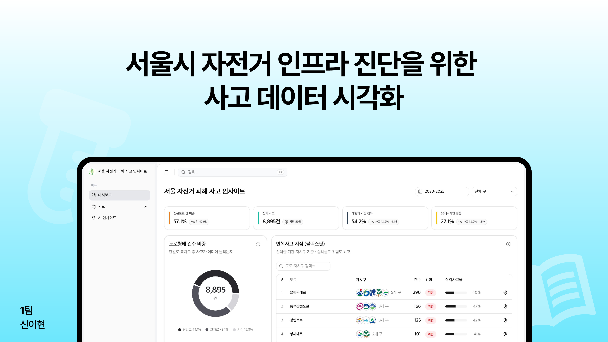

<div align="center">



<br/>

<h1>서울 자전거 피해 사고 인사이트</h1>

<p>표만 봐서는 안 보이는 위험을, 지도와 대시보드로 시각화합니다.</p>

<p>
  
  
  
  
  
  
</p>

</div>

---

## 소개

서울 자전거 도로는 매년 늘어나지만 사고는 줄지 않습니다. 이 프로젝트는 "어느 도로부터 손봐야 하는지" 표만으로는 판단하기 어려운 문제를, 한국도로교통공단(TAAS) 자전거 사고 데이터와 자전거 전용도로(OSM) 데이터를 결합해 대시보드로 시각화합니다.

**핵심 질문 세 가지**

1. 전용도로 안과 밖, 어디가 더 위험한가
2. 사고는 특정 도로·시간대에 반복해서 몰리는가
3. 구별 사고건수와 전용도로는 어떤 관계가 있는가

## 데모


## 데이터 파이프라인

```
TAAS API 조회 → 원본 CSV → 좌표 변환·구/도로 매칭 → bike_accident_insights.json → 대시보드
```

| 스크립트 | 역할 |
|---|---|
| `backend/fetch_taas_bike_accidents.py` | TAAS 자전거 사고 원본 수집 |
| `backend/rebuild_accident_points.py` | 사고 지점 좌표 정리 |
| `backend/build_bike_road_polygons.py` + `annotate_taas_bike_infra.py` | 자전거 전용도로 생성 · 사고와 매칭 |
| `backend/build_bike_accident_insights.py` | 대시보드용 최종 인사이트 JSON 생성 |

## 시작하기

```bash
cp .env.example .env   # OPENROUTER_API_KEY 채우기

cd frontend
npm install
npm run dev
```

## 프로젝트 구조

```
seoul-access-map/
├─ frontend/        # Next.js 대시보드 · 지도 · AI 인사이트
├─ backend/         # 데이터 수집 · 가공 파이프라인 (Python)
├─ data/            # 원본 CSV
└─ docs/            # 기획서 · 발표자료
```

## 발표자료

[서울시 자전거 인프라 진단을 위한 사고 데이터 시각화 발표자료.pdf](./docs/서울시%20자전거%20인프라%20진단을%20위한%20사고%20데이터%20시각화%20발표자료.pdf)